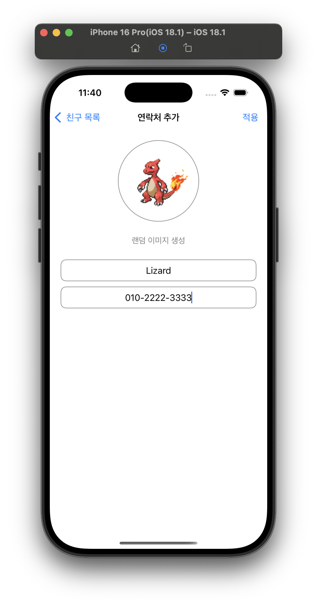

# 📱 Pokemon PhoneBook App


이 앱은 사용자가 **포켓몬 랜덤 이미지와 이름, 전화번호를 입력하여 연락처를 저장**할 수 있는 iOS 애플리케이션입니다. 저장된 연락처는 **Core Data**를 이용해 저장되며, 테이블뷰를 통해 목록 형태로 확인할 수 있습니다.

---

## ✅ 주요 기능

- 포켓몬 API를 활용한 **랜덤 이미지 불러오기**
- 이름, 전화번호 입력 필드를 통한 연락처 추가
- Core Data를 이용한 **연락처 저장 및 불러오기**
- 테이블뷰를 통한 저장된 연락처 목록 보기
- **UINavigationController** 기반 화면 전환
- **SnapKit**을 이용한 오토레이아웃

---

## 🛠 사용된 기술 스택

| 기능 | 기술 |
|------|------|
| UI 구성 | UIKit, SnapKit |
| 데이터 저장 | Core Data |
| 이미지 네트워크 | URLSession |
| API | [PokeAPI](https://pokeapi.co/) |
| 화면 전환 | UINavigationController |

---

## 📂 폴더 구조
```plaintext
PokemonApp/
├── CoreDatas/
│   ├── PhoneBook+CoreDataClass.swift
│   └── PhoneBook+CoreDataProperties.swift
│
├── PokemonApp/
│   ├── Application/
│   │   ├── AppDelegate.swift
│   │   └── SceneDelegate.swift
│   │
│   ├── Models/
│   │   ├── PokemonImageURL.swift
│   │   └── PokemonModel.xcdatamodeld
│   │
│   ├── Resources/
│   │   ├── Assets.xcassets
│   │   └── Info.plist
│   │
│   ├── Views/
│   │   ├── PhoneBookViewController.swift
│   │   ├── TableViewCell.swift
│   │   └── ViewController.swift
│
├── LaunchScreen.storyboard
```

